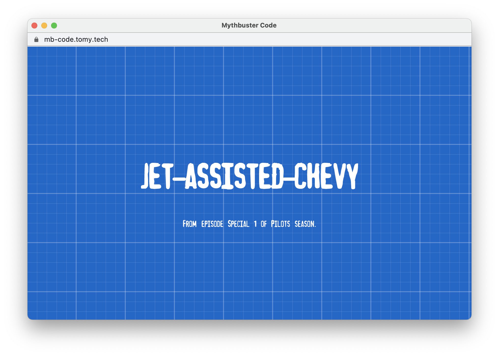

# MythBuster Code


🧨📋 A code name generator based on MythBusters episode names

> Remember, kids, the only difference between screwing around and science is writing it down
>
> -- <cite>Adam Savage</cite>

If you've been having a hard time coming up names or codes for your next big thing, I got you covered.😎



## Usage

* Hit space button for a new code
* Dispatch copy keyboard shortcut (`⌃C` or `⌘C`) to copy the code

## Development Guide

### Install

```sh
npm install
```

### Run development server
```sh
npm run serve
```

### Build for production
```sh
npm run build
```

### Lint and fix files
```sh
npm run lint
```
